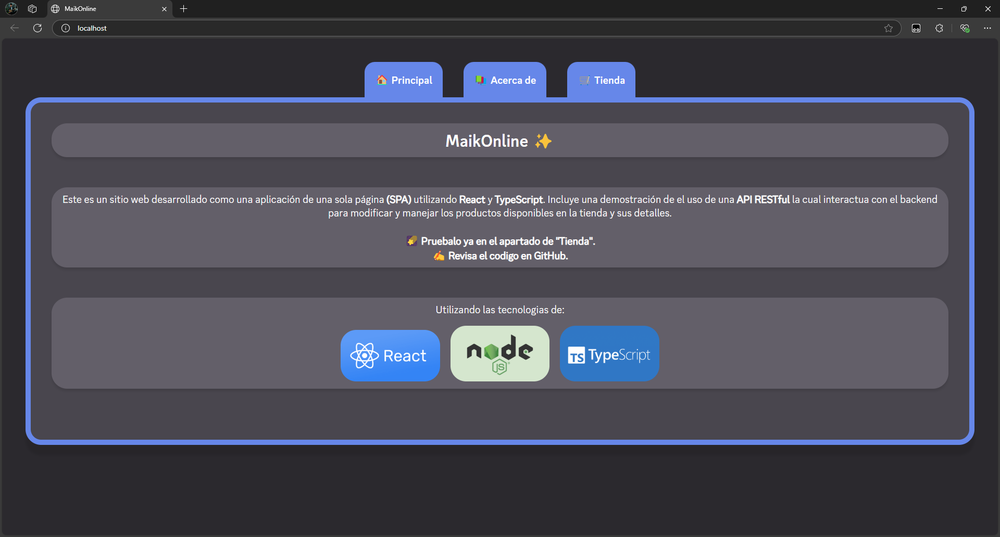
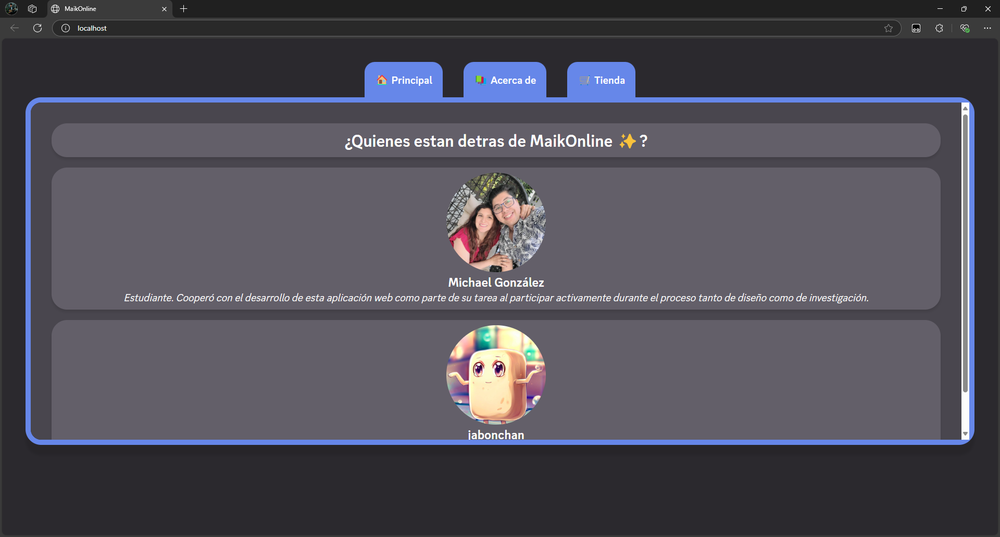
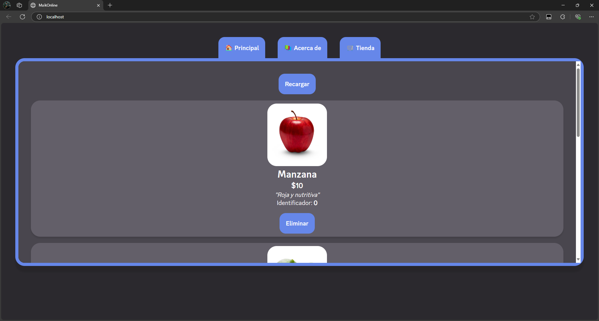

<h1 align="center">MaikOnline ✨</h1>

# ¿Qué es MaikOnline?

> Esta aplicación depende de recursos encontrados en línea, por lo que para utilizarla deberas estar conectado al internet mientras se ejecuta la aplicación.

MaikOnline es un sitio web desarrollado como una aplicación de una sola página (**SPA**) utilizando **React**, **Node.js** y **TypeScript**. Incluye una
demostración del uso de una **API RESTful**, la cual interactúa con el backend
para gestionar y modificar los productos disponibles en la tienda, así como sus
detalles.

---
<br />

# Scripts ⚙️

### `npm run start`
Ejecuta todos los pasos necesarios para preparar el servidor, utilizando la configuración especificada en el archivo `.env` ubicado en la carpeta del proyecto. Una vez listo, inicia el servidor para que sea accesible desde un navegador web.

---
<br />

# Frontend 🎈

**MaikOnline** cuenta con tres secciones principales: **Principal**, **Acerca de** y **Tienda**.

En las secciones de **Principal** y **Acerca de**, encontrarás información relevante sobre la aplicación, incluyendo créditos y otros detalles importantes.

La sección de **Tienda** presenta una lista de productos junto con sus respectivos detalles. Esta parte de la aplicación se comunica con el servidor a través de una **API RESTful**, lo que permite acceder a los productos almacenados en la base de datos. Además, no solo es posible consultar productos, sino también añadir nuevos. Estos se integran en la base de datos mediante la misma **API**, garantizando una lista de productos actualizada y persistente.

<p align="center">
    
    
    
</p>

<p align="center">
    <i>Capturas de pestañas disponibles en la aplicación.</i>
</p>

---
<br />

# Backend: Introducción 🥷

### ¿Cómo funciona?

El backend de **MaikOnline** realiza las siguientes tareas:
- [**A**](#paso-a-transpilación). Escanea, transpila y almacena en caché los
  archivos de código.
- [**B**](#paso-b-servidor). Crea una instancia de la clase `Server`.
- [**C**](#paso-c-api). Se registran las APIs en el servidor.

---
<br />

# Backend: Pasos 🚶‍➡️

### Paso A: *"Transpilación"*

Al inicializar la aplicación, **MaikOnline** escanea automáticamente la carpeta del proyecto en busca de archivos de código fuente que serán entregados al frontend.

Una vez localizados, estos archivos se transpilan de **TS**, **TSX** o **JSX** a JavaScript moderno, asumiendo el uso de **React** como framework.

El código transpilado se almacena en un objeto `Map`, que actúa como caché mientras la aplicación está en ejecución. Todas las solicitudes de archivos **TS**, **TSX** o **JSX** se responden con el código transpilado almacenado en la caché, si está disponible.

Esta metodología permite actualizar el código simplemente reiniciando el servidor, sin necesidad de transpilar manualmente ni modificar las referencias de importación a los archivos resultantes. Esto implica solo una ligera demora al iniciar el servidor, especialmente en proyectos pequeños o medianos que no afecta
el tiempo de respuesta de los pedidos una vez el servidor este en marcha.

### Paso B: *"Servidor"*

`Server` es una clase desarrollada específicamente para **MaikOnline** que actúa como un envoltorio para los métodos del módulo `node:http`, proporcionando utilidades como el procesamiento automático de solicitudes de **API** y su asignación a las funciones correspondientes registradas mediante el método `api`.

Además, expone las solicitudes comunes a través del evento `request`. Esto se utiliza dentro del código de **MaikOnline** para servir los recursos al frontend.

### Paso C: *"API"*

Se registra la **API** `shop-items` en la instancia de `Server` para que todas las solicitudes a la ruta `/api/shop-items/` sean dirigidas a la función correspondiente, proporcionando el cuerpo de la solicitud si existe uno.

---
<br />

# Backend: API 🤓

La **API** utilizada en esta aplicación se llama `shop-items`. Se puede acceder a ella mediante la ruta `/api/shop-items` y utilizando distintos métodos **HTTP**. Primero, definamos la interfaz de un `Item`, que es un tipo utilizado constantemente en esta **API**:

```ts
interface ShopItem {
    id: number;  
    name: string;  
    description: string;  
    price: number;  
    imageUrl: number;  
}
```

Contamos con las siguientes rutas:

### GET: `/api/shop-items/list`
Devuelve un `Array<string>` en formato **JSON**, donde cada `string` representa el `id` de un producto.

> Siempre devuelve el estado `200`.

### GET: `/api/shop-items/${id}`
Devuelve un `ShopItem` en formato **JSON**, correspondiente al producto con la `id` especificada. Si no se encuentra ningún producto, se devuelve `{ error: string }`.

> Dependiendo del resultado, devuelve el estado `200` o `404`.

### POST: `/api/shop-items/${id}`
Se debe enviar en el cuerpo de la solicitud un `ShopItem` en formato **JSON**, el cual se guardará en la base de datos. Puede usarse para reemplazar un producto con la misma `id` o crear uno nuevo. Si el cuerpo enviado es inválido, se devuelve `{ error: string }`.

> Dependiendo del resultado, devuelve el estado `200` o `400`.

### DELETE: `/api/shop-items/${id}`
Elimina el producto asociado a la `id` proporcionada. Si el producto no existe, se devuelve `{ error: string }`. En caso contrario, se devuelve `{ message: string }`.

> Dependiendo del resultado, devuelve el estado `200` o `404`.